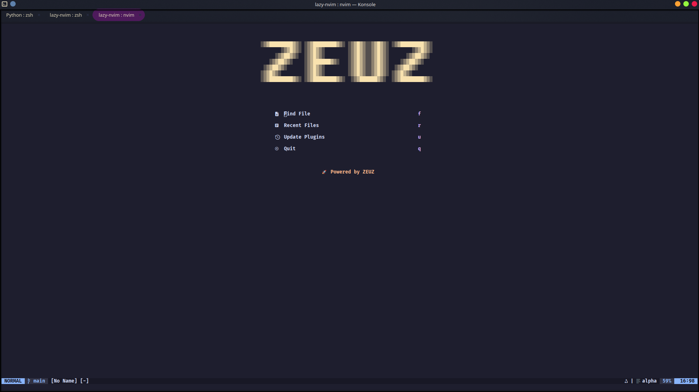
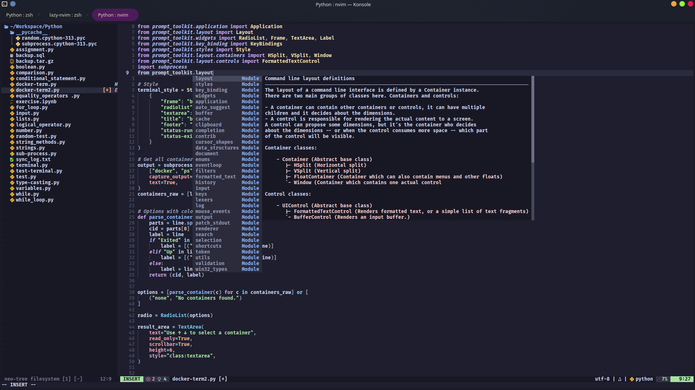
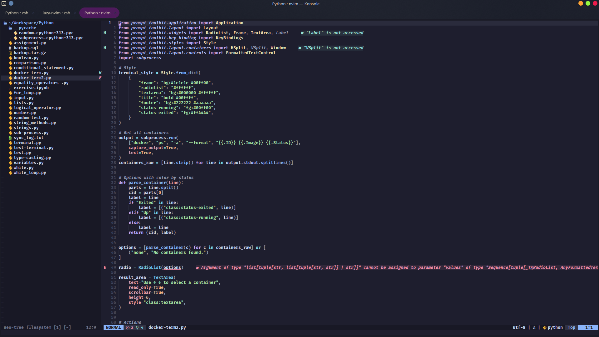
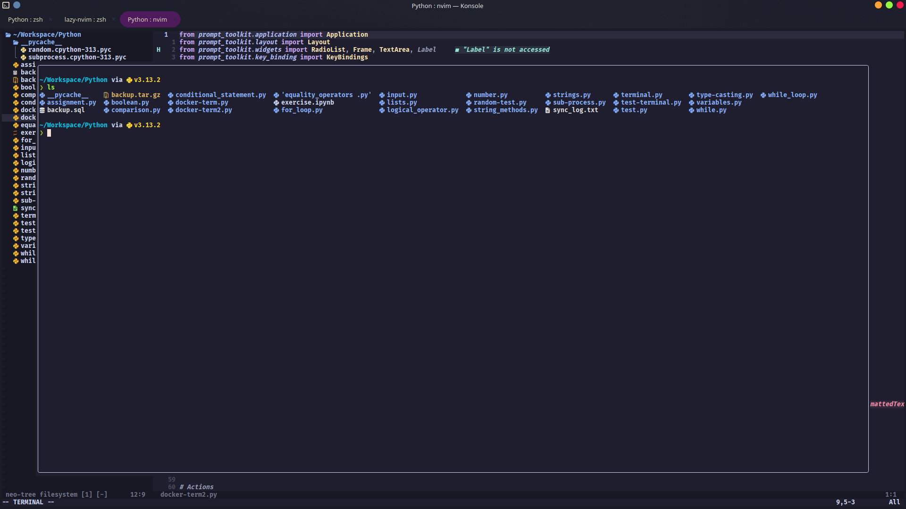
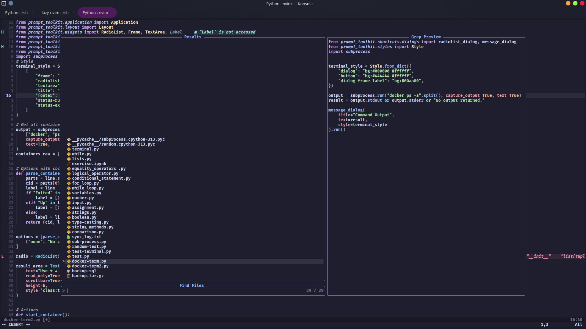

# ZEUZ Neovim Configuration

<div align="center">
  


```
░▒▓████████▓▒░ ░▒▓████████▓▒░ ░▒▓█▓▒░░▒▓█▓▒░ ░▒▓████████▓▒░ 
       ░▒▓█▓▒░ ░▒▓█▓▒░        ░▒▓█▓▒░░▒▓█▓▒░        ░▒▓█▓▒░ 
     ░▒▓██▓▒░  ░▒▓█▓▒░        ░▒▓█▓▒░░▒▓█▓▒░      ░▒▓██▓▒░  
   ░▒▓██▓▒░    ░▒▓██████▓▒░   ░▒▓█▓▒░░▒▓█▓▒░    ░▒▓██▓▒░    
 ░▒▓██▓▒░      ░▒▓█▓▒░        ░▒▓█▓▒░░▒▓█▓▒░  ░▒▓██▓▒░      
░▒▓█▓▒░        ░▒▓█▓▒░        ░▒▓█▓▒░░▒▓█▓▒░ ░▒▓█▓▒░        
░▒▓████████▓▒░ ░▒▓████████▓▒░  ░▒▓██████▓▒░  ░▒▓████████▓▒░ 
```

A modern, feature-rich Neovim configuration focused on productivity and aesthetics

</div>

## ✨ Features

- 🎨 Beautiful [Catppuccin](https://github.com/catppuccin/nvim) color scheme
- 🚀 Fast startup with lazy loading
- 📁 File explorer with [Neo-tree](https://github.com/nvim-neo-tree/neo-tree.nvim)
- 🔍 Fuzzy finder with [Telescope](https://github.com/nvim-telescope/telescope.nvim)
- 🧠 LSP support for intelligent code completion
- 🌳 Syntax highlighting with [Treesitter](https://github.com/nvim-treesitter/nvim-treesitter)
- ⚡ Efficient code editing with multiple quality-of-life plugins
- 💻 Customizable dashboard with [Alpha](https://github.com/goolord/alpha-nvim)
- 🔧 Simple yet powerful keybindings
- 📈 Git integration with [Gitsigns](https://github.com/lewis6991/gitsigns.nvim)
- 🖥️ Integrated terminal with [Toggleterm](https://github.com/akinsho/toggleterm.nvim)


## 📸 Screenshots

<details>
<summary>Click to expand screenshots</summary>

### Dashboard


### Code Editing


### File Explorer


### Terminal Integration


### Fuzzy Finding


</details>

## 📋 Requirements

### Neovim 0.9+ 

#### Ubuntu/Debian
```bash
sudo add-apt-repository ppa:neovim-ppa/unstable
sudo apt update
sudo apt install neovim
```

#### Fedora
```bash
sudo dnf install -y neovim python3-neovim
```

### Dependencies

#### Ubuntu/Debian
```bash
sudo apt install git curl unzip ripgrep fd-find nodejs npm python3-pip
```

#### Fedora
```bash
sudo dnf install git curl unzip ripgrep fd-find nodejs npm python3-pip
```

### Language Servers
This configuration automatically installs LSP servers through [Mason](https://github.com/williamboman/mason.nvim). By default, it will install:
- Lua language server (lua_ls)
- Python language server (pyright)

## 🚀 Installation

1. Backup your existing configuration (if any):
   ```bash
   mv ~/.config/nvim ~/.config/nvim.backup
   ```

2. Clone this repository:
   ```bash
   git clone https://github.com/yourusername/zeuz-nvim.git ~/.config/nvim
   ```

3. Start Neovim:
   ```bash
   nvim
   ```

4. The configuration will automatically install the package manager and plugins on first launch.

## ⌨️ Keybindings

### General

| Key | Action | Mode |
|-----|--------|------|
| `<Space>` | Leader key | - |
| `<Space>w` | Save file | Normal |
| `<Space>q` | Quit | Normal |
| `<Space>e` | Toggle file explorer | Normal |
| `<Esc>` | Clear search highlight | Normal |

### Navigation

| Key | Action | Mode |
|-----|--------|------|
| `<Ctrl-h>` | Move to left window | Normal |
| `<Ctrl-j>` | Move to lower window | Normal |
| `<Ctrl-k>` | Move to upper window | Normal |
| `<Ctrl-l>` | Move to right window | Normal |
| `<Tab>` | Next buffer | Normal |
| `<Shift-Tab>` | Previous buffer | Normal |
| `<Space>bd` | Delete buffer | Normal |

### Code Editing

| Key | Action | Mode |
|-----|--------|------|
| `<` | Indent left (keeps selection) | Visual |
| `>` | Indent right (keeps selection) | Visual |
| `<Alt-j>` | Move line/selection down | Normal/Visual/Insert |
| `<Alt-k>` | Move line/selection up | Normal/Visual/Insert |

### LSP

| Key | Action | Mode |
|-----|--------|------|
| `gd` | Go to definition | Normal |
| `gr` | Find references | Normal |
| `K` | Show hover documentation | Normal |
| `<Space>rn` | Rename symbol | Normal |
| `<Space>ca` | Code actions | Normal |
| `<Space>f` | Format code | Normal |

### Telescope

| Key | Action | Mode |
|-----|--------|------|
| `<Space>ff` | Find files | Normal |
| `<Space>fg` | Live grep (find text) | Normal |
| `<Space>fb` | Find buffers | Normal |
| `<Space>fh` | Find help tags | Normal |
| `<Space>fs` | Find in current file | Normal |

### Git

| Key | Action | Mode |
|-----|--------|------|
| `<Space>hp` | Preview git hunk | Normal |
| `<Space>hb` | Git blame line | Normal |
| `<Space>hd` | Git diff against index | Normal |

### Terminal

| Key | Action | Mode |
|-----|--------|------|
| `<Ctrl-\>` | Toggle terminal | Normal |

## 🧩 Plugins

This configuration comes with the following plugins:

- **Package Manager**
  - [lazy.nvim](https://github.com/folke/lazy.nvim)

- **Appearance**
  - [catppuccin/nvim](https://github.com/catppuccin/nvim) - Color scheme
  - [nvim-lualine/lualine.nvim](https://github.com/nvim-lualine/lualine.nvim) - Status line
  - [goolord/alpha-nvim](https://github.com/goolord/alpha-nvim) - Dashboard
  - [lukas-reineke/indent-blankline.nvim](https://github.com/lukas-reineke/indent-blankline.nvim) - Indent guides

- **Navigation & UI**
  - [nvim-neo-tree/neo-tree.nvim](https://github.com/nvim-neo-tree/neo-tree.nvim) - File explorer
  - [nvim-telescope/telescope.nvim](https://github.com/nvim-telescope/telescope.nvim) - Fuzzy finder
  - [karb94/neoscroll.nvim](https://github.com/karb94/neoscroll.nvim) - Smooth scrolling
  - [folke/which-key.nvim](https://github.com/folke/which-key.nvim) - Keybinding helper

- **LSP & Completion**
  - [neovim/nvim-lspconfig](https://github.com/neovim/nvim-lspconfig) - LSP configuration
  - [williamboman/mason.nvim](https://github.com/williamboman/mason.nvim) - Package manager for LSP
  - [williamboman/mason-lspconfig.nvim](https://github.com/williamboman/mason-lspconfig.nvim) - Bridge between Mason and LSP
  - [hrsh7th/nvim-cmp](https://github.com/hrsh7th/nvim-cmp) - Completion engine
  - [L3MON4D3/LuaSnip](https://github.com/L3MON4D3/LuaSnip) - Snippet engine

- **Syntax & Highlighting**
  - [nvim-treesitter/nvim-treesitter](https://github.com/nvim-treesitter/nvim-treesitter) - Syntax highlighting

- **Tools & Integration**
  - [lewis6991/gitsigns.nvim](https://github.com/lewis6991/gitsigns.nvim) - Git integration
  - [numToStr/Comment.nvim](https://github.com/numToStr/Comment.nvim) - Comment toggling
  - [windwp/nvim-autopairs](https://github.com/windwp/nvim-autopairs) - Auto pairs
  - [akinsho/toggleterm.nvim](https://github.com/akinsho/toggleterm.nvim) - Terminal integration

## 🔧 Configuration Structure

```
~/.config/nvim/
├── init.lua                 # Main configuration file
└── lazy-lock.json          # Plugin version lockfile (auto-generated)
```

## 🎨 Customization

To customize this configuration, you can modify the `~/.config/nvim/init.lua` file. The configuration is well-documented with comments explaining each section.

## 🤝 Contributing

Contributions are welcome! Please feel free to submit a Pull Request.

## 📜 License

This project is licensed under the MIT License - see the LICENSE file for details.

## 💖 Credits

Special thanks to the Neovim community and all the plugin authors that make this configuration possible.

---

<div align="center">
  
🚀 Powered by ZEUZ

</div>
